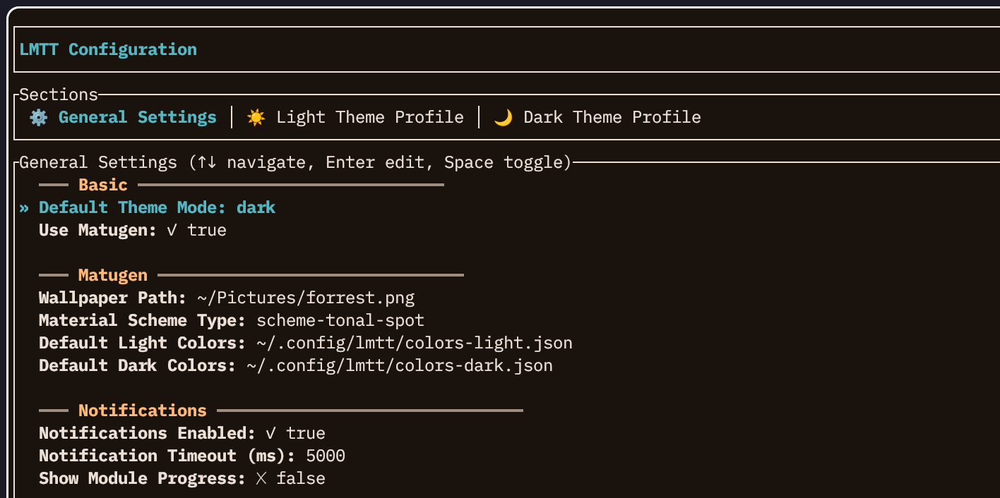
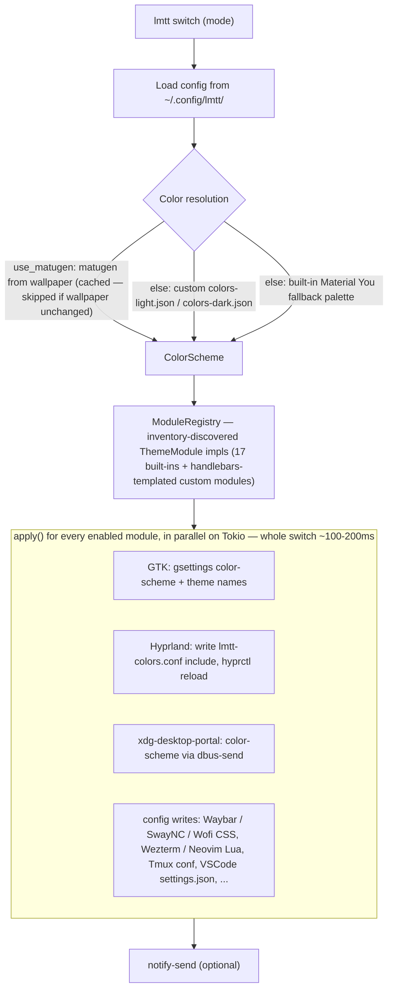

# LMTT - Linux Multi-Theme Toggle

**High-performance, async theme switching for Hyprland/Wayland desktops** with Material You color schemes.

## Features

- ⚡ **Blazing Fast**: Async Rust implementation, modules run in parallel
- 🎨 **Flexible Theming**: Material You colors from wallpapers (via [matugen](https://github.com/InioX/matugen)), custom JSON colors, or built-in fallback themes
- 🔌 **Modular**: Supports 14+ applications (Waybar, Hyprland, VSCode, Wezterm, SwayNC, etc.)
- 🎯 **Auto-Detection**: Only applies themes to installed applications
- 🔧 **Easy Setup**: Auto-injects config includes with `lmtt setup`
- 🧹 **Clean Uninstall**: `lmtt cleanup` removes all injected config
- ⚙️ **Highly Configurable**: TOML config at `~/.config/lmtt/config.toml`
- 🔔 **Desktop Notifications**: Optional notifications for theme changes

## Installation

### Arch Linux

Add the `[mason]` repo to `/etc/pacman.conf`, then install:

```ini
[mason]
SigLevel = Optional TrustAll
Server = https://masonrhodesdev.github.io/arch-repo/x86_64
```

```bash
sudo pacman -Sy lmtt
```

### Fedora

```bash
sudo dnf copr enable solaris765/lmtt
sudo dnf install lmtt
```

### Optional Runtime Dependencies

- [matugen](https://github.com/InioX/matugen) - **Optional**, for wallpaper-based color generation
  - If not installed, LMTT uses built-in Material You fallback themes
  - Can also use custom JSON color files
- GTK 3/4 applications (optional, for `gsettings` integration)

### Build from Source

Requires Rust 1.70+ (`rustup` recommended):

```bash
git clone https://github.com/MasonRhodesDev/linux-multi-theme-toggle.git
cd linux-multi-theme-toggle
sudo make install PREFIX=/usr
```

This installs both binaries (`lmtt`, `lmtt-config`) plus the config example
and custom-module examples under `/usr/share/lmtt/`.

## Quick Start

1. **Initialize config**:
   ```bash
   lmtt init
   ```

2. **Edit config** at `~/.config/lmtt/config.toml`:
   ```toml
   [general]
   wallpaper = "~/Pictures/your-wallpaper.png"
   ```

3. **Run setup** (auto-configures app config files):
   ```bash
   lmtt setup
   ```

4. **Switch theme**:
   ```bash
   lmtt switch         # Toggle between light/dark
   lmtt switch dark    # Switch to dark mode
   lmtt switch light   # Switch to light mode
   ```

## Usage

### Configuration Manager (Interactive TUI)

Launch the interactive configuration manager:

```bash
lmtt config
```

Every setting is editable from one screen:



The schema-driven TUI has three sections:
- **General** - wallpaper, default_mode, scheme_type, use_matugen, default color files, with Notifications / Performance / Cache / Logging as subsections
- **Light Profile** - GTK/icon/cursor themes, fonts, VSCode theme, opacity, blur for light mode
- **Dark Profile** - the same settings for dark mode

Modules are not toggled from the TUI — enable or disable one by editing
`[modules.<name>]` `enabled = false` in `~/.config/lmtt/config.toml` (modules
are otherwise auto-skipped when their app isn't installed).

**Controls:**
- `Tab`/`←→`/`h/l` - Switch between sections
- `↑↓` or `j/k` - Navigate items
- `Space/Enter` - Toggle boolean values
- `e` - Open full config in `$EDITOR`
- `q/Esc` - Quit

Changes are saved immediately to `~/.config/lmtt/config.toml`.

### Commands

```bash
# Switch theme
lmtt switch                   # Toggle between light/dark
lmtt switch dark              # Switch to dark mode
lmtt switch light             # Switch to light mode
lmtt switch --no-notify       # Toggle without notifications

# Interactive configuration
lmtt config                   # TUI for managing all settings

# Setup mode (configure app configs)
lmtt setup
lmtt setup --dry-run

# Cleanup mode (remove lmtt config injections)
lmtt cleanup
lmtt cleanup --module waybar  # Cleanup specific module
lmtt cleanup --dry-run

# Status and info
lmtt status
lmtt list
lmtt list --all
```

### Configuration

Config file: `~/.config/lmtt/config.toml`

```toml
[general]
wallpaper = "~/Pictures/forrest.png"
default_mode = "dark"
scheme_type = "scheme-tonal-spot"
use_matugen = true  # Set to false to use fallback/custom colors
default_light_colors = "~/.config/lmtt/colors-light.json"
default_dark_colors = "~/.config/lmtt/colors-dark.json"

[notifications]
enabled = true
timeout = 5000

[modules.waybar]
enabled = true

[modules.hyprland]
enabled = true
```

**Key features**:
- **Modules enabled by default**: Apps are auto-detected and run if installed
- **Disable modules**: Set `enabled = false` to skip specific apps
- **Flexible color sources**:
  - **matugen** (default): Generate colors from wallpaper
  - **Custom JSON**: Provide your own `colors-light.json` and `colors-dark.json`
  - **Built-in fallback**: Material You themes if matugen not available

### Custom Color Schemes

Create your own color schemes by placing JSON files at `~/.config/lmtt/colors-light.json` and `~/.config/lmtt/colors-dark.json`:

```json
{
  "surface": "#fbf8ff",
  "on_surface": "#1a1b23",
  "primary": "#3a6a33",
  "on_primary": "#ffffff",
  "secondary": "#7d525f",
  "error": "#ba1a1a",
  "outline": "#74767f",
  "surface_variant": "#e0e2ec",
  "on_surface_variant": "#44464f"
}
```

Set `use_matugen = false` in config to use custom colors instead of wallpaper-based generation.

## Custom Modules

LMTT supports user-defined custom modules in `~/.config/lmtt/modules/` - no recompilation needed!

### Three Module Types

**1. Declarative (Template-based)** - For simple config files:
```toml
# ~/.config/lmtt/modules/alacritty.toml
name = "alacritty"
binary = "alacritty"

[output]
path = "~/.config/alacritty/lmtt-colors.yml"

[template]
content = """
colors:
  primary:
    background: '{{surface}}'
    foreground: '{{on_surface}}'
"""
```

**2. Script-based** - For complex logic:
```toml
# ~/.config/lmtt/modules/spotify.toml
name = "spotify"
binary = "spotify"

[script]
path = "~/.config/lmtt/scripts/spotify.sh"
timeout = 10000
```

Custom modules are automatically discovered and loaded. See `examples/modules/` for working examples (Alacritty, Kitty, Discord, Spotify) and `examples/README-modules.md` for full documentation.

## Supported Applications

### Built-in Modules (Rust)

| Module | Config File | Auto-Setup |
|--------|-------------|------------|
| GTK | gsettings | ✓ |
| Waybar | `style.css` | ✓ |
| Hyprland | `lmtt-colors.conf` | ✓ |
| SwayNC | `style.css` | ✓ |
| Wezterm | `lmtt-colors.lua` | ✓ |
| Tmux | `lmtt-colors.conf` | ✓ |
| Neovim | `lmtt-colors.lua` | ✓ |
| VSCode | `settings.json` | ✓ |
| Wofi | `style.css` | ✓ |
| Fish | universal variables (`set -U`) | — |

## Setup Mode

`lmtt setup` checks your installed applications and prompts to inject config includes:

```bash
$ lmtt setup
🔧 LMTT Setup Mode
================

✓ waybar detected
  📄 /home/user/.config/waybar/style.css
     Import lmtt colors into Waybar CSS
     ⚠ Include line missing:
     @import url('../matugen/lmtt-colors.css');

     Inject this line? [Y/n/q] y
     ✓ Injected successfully!
```

### What gets injected?

Each module adds a marked block at the top of your config:

```css
/* >>> lmtt managed block - do not edit manually >>> */
@import url('../matugen/lmtt-colors.css');
/* <<< lmtt managed block <<< */

/* Your existing config below */
```

The marker comment syntax matches the file type: CSS uses `/* */`, Lua uses
`--`, and conf/ini files use `#`.

This allows clean removal with `lmtt cleanup`.

## Cleanup/Uninstall

Remove all lmtt-injected config lines:

```bash
# Clean all modules
lmtt cleanup

# Clean specific module
lmtt cleanup --module waybar

# Dry run (see what would be removed)
lmtt cleanup --dry-run
```

This is **completely non-intrusive** - your original config files are restored.

## Architecture

Runtime pipeline for a theme switch:



```
lmtt/               # CLI binary
lmtt-core/          # Core types (Config, ColorScheme, Cache)
lmtt-modules/       # Theme modules (Waybar, Hyprland, etc.)
lmtt-platforms/     # Platform backends (GTK, XDG, Qt)
```

### Adding a Custom Module

See `lmtt-modules/src/waybar.rs` for a template. Key points:

1. Implement `ThemeModule` trait
2. Specify `binary_name()` for auto-detection
3. Implement `apply()` for theme switching
4. Implement `config_files()` for setup mode
5. Add to `ModuleRegistry` in `registry.rs`

## Performance

Typical theme switch: **~100-200ms**

- Modules run in parallel (Tokio async)
- No blocking I/O
- Wallpaper color caching (skips regeneration if unchanged)

Performance warnings for slow modules (>250ms default).

## Notifications

Desktop notifications are shown when the theme changes (disable with
`--no-notify`, or `[notifications] enabled = false` in the config). Set
`show_module_progress = true` for a per-module notification as each applies.

## Troubleshooting

### Module not running?

```bash
# Check if app is installed
lmtt list --all

# Check config
lmtt status

# Verbose output
lmtt -v switch dark
```

### Config not applied?

```bash
# Re-run setup
lmtt setup

# Verify config file includes lmtt block
cat ~/.config/waybar/style.css
```

### Cleanup not working?

Config files must have the lmtt marker comments. If you manually edited them, you may need to manually remove the include lines.

## Migration from Bash Version

The Rust version is a drop-in replacement with improved performance:

1. Backup your current bash scripts
2. Install lmtt
3. Run `lmtt init` and `lmtt setup`
4. Test with `lmtt switch dark`

Your existing module configs should work without changes.

## Contributing

Contributions welcome! Areas needing help:

- [ ] Additional module support (Alacritty, Kitty, etc.)
- [ ] Platform backends (KDE Plasma integration)
- [ ] Documentation improvements
- [ ] Testing on different distros

## License

MIT

## Credits

- [matugen](https://github.com/InioX/matugen) - Material You color generation
- Original bash implementation by Mason
